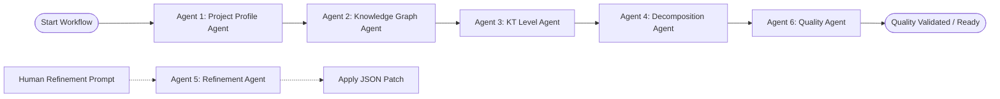

# KT Planner — LangGraph AI Multi-Agent Architecture

## 1. Multi-Agent Ecosystem Overview

KT Planner implements a multi-agent ecosystem orchestrated by **LangGraph** (`langgraph.graph.StateGraph`). Each agent possesses specialized reasoning capabilities focused on a specific stage of the transition planning lifecycle.



---

## 2. LangGraph State Machine Architecture

### 2.1 State Schema & Memory Isolation Principle
In traditional LLM pipelines, passing huge tabular plans through graph state leads to context window exhaustion, latency spikes, and hallucinations. 

KT Planner enforces **Memory Isolation**:
- LangGraph state carries only metadata (`transition_id`, `current_stage`, `status_message`, `errors`).
- Agents inspect database state via typed ORM queries and write mutations directly to SQLite.

```python
class KTPlannerState(TypedDict):
    transition_id: str
    current_stage: str
    status_message: str
    errors: List[str]
```

### 2.2 Compiled StateGraph Pipeline
Defined in `backend/ai/workflow.py`:
- Node 1: `profile_agent`
- Node 2: `knowledge_graph_agent`
- Node 3: `kt_level_agent`
- Node 4: `decomposition_agent`
- Node 5: `quality_agent`

---

## 3. Agent Roster & Detailed Execution Logic

### Agent 1 — Project Profile Agent
- **Purpose**: Extract structured transition profile from intake documents.
- **Inputs**: Raw JSON payload from the extraction adapter.
- **Outputs**: Normalized `ProjectProfile` record in SQLite.
- **Reasoning Actions**:
  - Identifies primary application name, business criticality, and SLA commitments.
  - Extracts technology stack, deployment environments, and support models.
  - Generates explicit evidence citations linking attributes to specific workbook sheets.
  - Identifies and flags undocumented gaps (e.g., missing functional module breakdown).

---

### Agent 2 — Knowledge Graph Agent
- **Purpose**: Construct 6-tier architectural taxonomy.
- **Hierarchy Standard**:
  $$\text{Application} \longrightarrow \text{Domain} \longrightarrow \text{Capability} \longrightarrow \text{Process} \longrightarrow \text{Topic} \longrightarrow \text{Subtopic}$$
- **Outputs**: Relational `KnowledgeNode` tree in SQLite.
- **Reasoning Actions**:
  - Groups topics into core enterprise domains (`Functional & Business`, `Architecture & Development`, `Cloud, Security & Operations`).
  - Creates capabilities and end-to-end process flows.
  - Decomposes topics into granular subtopics that hold specific hourly effort values.

---

### Agent 3 — KT Level Agent
- **Purpose**: Evaluate topics against Knowledge Transfer Levels (L1 / L2 / L3).
- **Supported Combinations**:
  `L1`, `L2`, `L3`, `L1+L2`, `L1+L3`, `L2+L3`, `L1+L2+L3`.
- **Outputs**: `KTLevelEvaluation` records for 100% of leaf topics.
- **Generated Schema**:
  - `Applicability`: `applicable`, `not_applicable`, `conditional`
  - `Justification`: Regulatory or operational requirement for this level
  - `Learning Objective`: Actionable knowledge goal
  - `Expected Outcome`: Measurable exit criteria for handover sign-off
  - `Evidence`: Traceability citation to intake materials.

---

### Agent 4 — Topic Decomposition Agent
- **Purpose**: Ensure 100% capacity utilization without artificial filler topics.
- **Inputs**: Capacity deficit from `CapacityService.evaluate_capacity_balance()`.
- **Expansion Strategies (Section 6 of Blueprint)**:
  - Incident Triage & Simulation Labs (AMS operations)
  - Disaster Recovery Failover & High Availability Live Drills
  - Secrets Rotation & Security Audit Walkthroughs
  - API Gateway Latency & Network Bottleneck Troubleshooting
  - CI/CD Failure Recovery & Rollback Drills
  - Database Performance Optimization & Index Tuning Labs
  - Batch Processing Exception Runbook Walkthroughs.
- **Termination Criterion**: Continues expansion until $\text{Generated Capacity} \ge \text{Target Capacity}$.

---

### Agent 5 — Refinement Agent
- **Purpose**: Translate natural language human feedback into atomic JSON patches.
- **Invocation**: Triggered on-demand via Stage 11 Refinement Input.
- **Outputs**: `PlanPatch` record with version incrementation.
- **Reasoning Actions**:
  - Interprets user instructions (e.g., *"Increase duration of Azure Key Vault session to 4 hours and assign to Dev Sharma"*).
  - Isolates target entities and constructs surgical JSON diff payloads.
  - Commits changes via `PatchService` without requiring full plan regeneration.

---

### Agent 6 — Quality & Compliance Agent
- **Purpose**: Validate generated plan against transition standards.
- **Execution**: Runs `ValidationService.run_full_validation()` to audit completeness, level coverage, and zero-conflict status prior to publishing.

---

## 4. LLM Adapter Configuration

KT Planner supports configurable AI backends configured via `backend/config.py`:
1. **Azure OpenAI**: Set `AZURE_OPENAI_API_KEY` and `AZURE_OPENAI_ENDPOINT`.
2. **OpenAI**: Set `OPENAI_API_KEY`.
3. **Deterministic Heuristic Inference (Fallback)**: When cloud API keys are not supplied, the platform executes high-fidelity domain heuristic algorithms directly against the extracted workbook schema. This ensures **100% offline, self-contained deployment readiness**.

