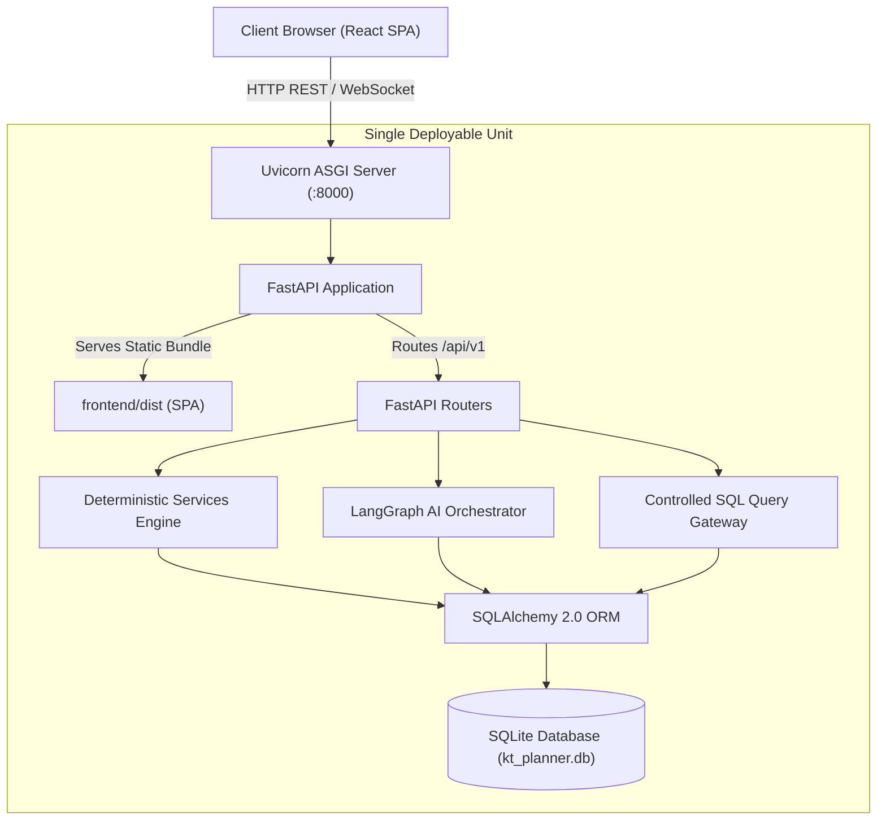
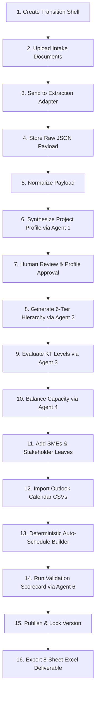

# KT Planner — Enterprise Architecture Blueprint

## Executive Summary & Product Vision

**KT Planner** is an AI-powered Transition Planning and Knowledge Transfer (KT) orchestration platform designed to automate the conversion of unstructured or semi-structured transition intake workbooks into a mathematically validated, conflict-free, level-aware, and schedulable Knowledge Transfer plan.

In traditional enterprise transitions, IT outsourcers and service providers face significant risks:
- Subject Matter Expert (SME) burnout due to overlapping sessions.
- Inaccurate capacity forecasts failing to account for client holidays and vendor shadow/reverse-shadow phases.
- Vague, high-level topics that lack operational depth and measurable learning objectives.
- Fragmented schedules with zero calendar conflict detection.
- Lack of auditability and traceability back to source contract deliverables.

KT Planner solves these challenges by combining **Deterministic Core Engines** for mathematical precision, scheduling, and calendar conflict detection with **LangGraph AI Agents** for semantic document parsing, taxonomy construction, and curriculum evaluation.

---

## 1. Guiding Principles & Architectural Pillars

### 1.1 Strict Separation of AI and Deterministic Responsibilities

To eliminate AI hallucination from operational dates, hours, and legal commitments, the system enforces a strict boundary between probabilistic AI inference and deterministic calculations:

```
┌──────────────────────────────────────────────┐  ┌──────────────────────────────────────────────┐
│           AI LAYER RESPONSIBILITIES          │  │       DETERMINISTIC CORE RESPONSIBILITIES    │
├──────────────────────────────────────────────┤  ├──────────────────────────────────────────────┤
│ • Document understanding & intake parsing    │  │ • Available KT days & capacity mathematics   │
│ • Project profile synthesis & gap detection  │  │ • Bank holiday lookups (holidays.json only)  │
│ • 6-tier knowledge taxonomy generation       │  │ • Working day validation & weekend exclusion │
│ • L1/L2/L3 learning objectives & outcomes    │  │ • Outlook CSV calendar conflict detection    │
│ • Topic decomposition for capacity balancing │  │ • Conflict-free slot scheduling & sequencing │
│ • Natural language refinement interpretation │  │ • Governance validation audit scorecards     │
│ • Transition quality & compliance auditing   │  │ • OpenPyXL Excel & CSV deliverable streaming │
└──────────────────────────────────────────────┘  └──────────────────────────────────────────────┘
```

### 1.2 Authoritative Single Source of Truth

The SQLite database (`kt_planner.db`) is the authoritative source of truth for:
- Transition shells & project settings
- Uploaded intake workbooks and raw JSON payloads
- Synthesized project profiles and evidence citations
- 6-level knowledge taxonomy (`Application → Domain → Capability → Process → Topic → Subtopic`)
- KT level evaluations (L1, L2, L3, and composite combinations)
- Stakeholder rosters, leave records, and Outlook calendar events
- Scheduled KT sessions and conflict markers
- Version patches and compliance audit trails

### 1.3 Single Deployable Service Model

The system is architected as a lightweight, self-contained single deployable unit:



---

## 2. System Topology & Component Layout

```
KT_Planner_V4/
├── backend/
│   ├── ai/                    # LangGraph StateGraph & Multi-Agent Roster
│   │   ├── agents.py          # Agents 1 through 6
│   │   └── workflow.py        # Compiled LangGraph StateGraph pipeline
│   ├── models/                # SQLAlchemy ORM Data Models (12 tables)
│   ├── schemas/               # Pydantic v2 Type Enforcements & DTOs
│   ├── services/              # 8 Deterministic Business Logic Engines
│   │   ├── holiday_service.py # holidays.json loader & workday checks
│   │   ├── capacity_service.py# Capacity formula & balance engine
│   │   ├── calendar_service.py# Outlook CSV parser with header mapping
│   │   ├── availability_service.py # Conflict detection & heatmap
│   │   ├── scheduling_service.py   # Conflict-free session scheduler
│   │   ├── validation_service.py   # Governance readiness scorecard
│   │   ├── patch_service.py   # Atomic JSON patch & versioning
│   │   └── export_service.py  # OpenPyXL XLSX & CSV generator
│   ├── routers/               # Modular REST endpoints (/api/v1/...)
│   ├── database.py            # SQLite engine with FK enforcement
│   └── main.py                # FastAPI entrypoint & SPA host
├── frontend/                  # React 18 + TypeScript + Tailwind CSS SPA
│   ├── src/
│   │   ├── components/        # Stepper, Navbar, Modals
│   │   ├── components/pages/  # 12 Dedicated Stage Views
│   │   ├── api/client.ts      # Typed API Client
│   │   └── App.tsx            # Main Controller
│   └── dist/                  # Pre-compiled static SPA bundle
├── holidays.json              # Authoritative Bank Holidays (30+ countries)
├── alembic/                   # Alembic Database Migrations
└── tests/                     # 13 Automated Integration & Unit Tests
```

---

## 3. High-Level 16-Step Lifecycle Workflow

Every knowledge transfer transition executed in KT Planner follows an auditable 16-step pipeline:



---

## 4. Controlled Database Gateway Security

In compliance with enterprise data governance, AI agents and reporting utilities access the SQLite datastore via two distinct patterns:
1. **Typed Mutation APIs**: All inserts, updates, and deletes must pass through typed Pydantic endpoints that execute business logic and write audit logs.
2. **Controlled Read-Only SQL API (`POST /api/v1/database/query`)**:
   - Permits read-only `SELECT`, `WITH`, and `EXPLAIN` statements.
   - Enforces strict parameterized query execution.
   - Blocks all DDL/DML mutation keywords (`INSERT`, `UPDATE`, `DELETE`, `DROP`, `ALTER`, `CREATE`, `TRUNCATE`, `REPLACE`, `ATTACH`, `DETACH`, `PRAGMA`, `VACUUM`) with an immediate `HTTP 403 Forbidden`.

---

## 5. Technology Standards & Compatibility

| Component | Standard / Library | Purpose |
|---|---|---|
| Runtime | Python 3.13 | High-performance async runtime |
| Web Framework | FastAPI 0.141+ | Type-safe REST APIs with automatic OpenAPI docs |
| Database ORM | SQLAlchemy 2.0 | Typed relational ORM with SQLite foreign keys |
| Data Validation | Pydantic v2 | High-throughput schema validation |
| Migrations | Alembic 1.20+ | Schema versioning and automated DDL migrations |
| AI Orchestration | LangGraph 1.2+ & LangChain Core | State machine orchestration for multi-agent workflows |
| Excel Engine | OpenPyXL 3.1+ | Multi-sheet styling, gridlines, formulas, auto-fit columns |
| Frontend Shell | React 18 + TypeScript | Component-based reactive SPA |
| Styling | Tailwind CSS 3.4 | Utility-first responsive design |
| Hierarchy Visualization | React Flow 11.11 | Node-based interactive architecture graphs |
| Calendar Engine | FullCalendar 6.1 | Drag-and-drop timeline, week, and month scheduling |
| Table Management | TanStack Table 8.20 | Filterable, sortable matrix data grids |

