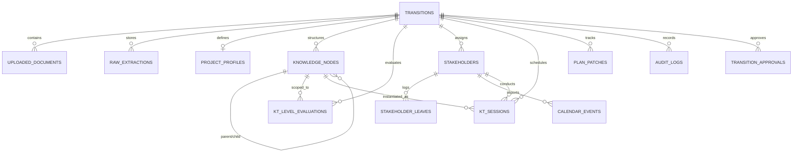

# KT Planner — Data Model & Relational Schema Reference

## 1. Entity-Relationship Diagram (ERD)

The following diagram illustrates the relational data model enforced in SQLite (`kt_planner.db`) via SQLAlchemy 2.0 ORM:

---

## 2. Table Specifications

### 2.1 `transitions`
The root entity representing an application knowledge transfer engagement.

| Column | Type | Constraints | Description |
|---|---|---|---|
| `id` | `VARCHAR(36)` | PK | Unique UUID string |
| `name` | `VARCHAR(255)` | NOT NULL | Engagement title (e.g., "Core Banking Transition") |
| `category` | `VARCHAR(100)` | DEFAULT `'development_and_ams'` | Transition scope type |
| `status` | `VARCHAR(50)` | DEFAULT `'draft'` | Lifecycle state (`draft`, `extracted`, `profile_generated`, `hierarchy_generated`, `levels_evaluated`, `capacity_balanced`, `scheduled`, `published`) |
| `start_date` | `DATE` | NOT NULL | Transition commencement date |
| `end_date` | `DATE` | NOT NULL | Transition completion date |
| `total_duration_days` | `INTEGER` | DEFAULT `60` | Gross duration in calendar days |
| `shadow_days` | `INTEGER` | DEFAULT `10` | Days dedicated to shadow observation |
| `reverse_shadow_days`| `INTEGER` | DEFAULT `10` | Days dedicated to independent reverse shadowing |
| `available_kt_days` | `INTEGER` | NOT NULL | Formula: `total_duration_days - shadow_days - reverse_shadow_days` |
| `daily_kt_hours` | `FLOAT` | DEFAULT `5.0` | Maximum productive KT hours scheduled per day |
| `target_capacity_hours`| `FLOAT` | NOT NULL | Formula: `available_kt_days * daily_kt_hours` |
| `primary_country` | `VARCHAR(100)`| DEFAULT `'India'` | Reference country key in `holidays.json` |
| `timezone` | `VARCHAR(50)` | DEFAULT `'Asia/Kolkata'`| Operating timezone |
| `created_at` | `DATETIME` | DEFAULT `UTC` | Record creation timestamp |
| `updated_at` | `DATETIME` | DEFAULT `UTC` | Last update timestamp |

---

### 2.2 `uploaded_documents`
Tracks files ingested during Stage 1.

| Column | Type | Constraints | Description |
|---|---|---|---|
| `id` | `VARCHAR(36)` | PK | Document UUID |
| `transition_id` | `VARCHAR(36)` | FK (`transitions.id`, CASCADE) | Owning transition |
| `file_name` | `VARCHAR(255)` | NOT NULL | Original uploaded filename |
| `file_path` | `VARCHAR(500)` | NOT NULL | Persistent local storage path |
| `file_size` | `INTEGER` | DEFAULT `0` | Size in bytes |
| `mime_type` | `VARCHAR(100)` | NOT NULL | MIME type |
| `checksum` | `VARCHAR(64)` | NULLABLE | SHA-256 integrity hash |
| `uploaded_at` | `DATETIME` | DEFAULT `UTC` | Upload timestamp |

---

### 2.3 `raw_extractions`
Stores raw and normalized payloads from the canonical transition extraction adapter.

| Column | Type | Constraints | Description |
|---|---|---|---|
| `id` | `VARCHAR(36)` | PK | Extraction UUID |
| `transition_id` | `VARCHAR(36)` | FK (`transitions.id`, CASCADE) | Owning transition |
| `raw_json_payload` | `JSON` | NOT NULL | Unmodified JSON output from extractor |
| `normalized_payload`| `JSON` | NULLABLE | Standardized transition model representation |
| `extracted_at` | `DATETIME` | DEFAULT `UTC` | Ingestion timestamp |

---

### 2.4 `project_profiles`
Synthesized by Agent 1 (Project Profile Agent) with evidence citations and identified gaps.

| Column | Type | Constraints | Description |
|---|---|---|---|
| `id` | `VARCHAR(36)` | PK | Profile UUID |
| `transition_id` | `VARCHAR(36)` | FK (`transitions.id`, CASCADE), UNIQUE | 1:1 link to transition |
| `project_name` | `VARCHAR(255)` | NOT NULL | Identified application title |
| `business_purpose` | `TEXT` | DEFAULT `''` | High-level business mission |
| `criticality` | `VARCHAR(100)` | DEFAULT `'Business-critical'` | SLA tier criticality |
| `technology_stack` | `JSON` | DEFAULT `[]` | List of languages, frameworks, cloud services |
| `environments` | `JSON` | DEFAULT `[]` | List of deployment environments (Dev, UAT, Prod) |
| `support_model` | `VARCHAR(100)` | DEFAULT `'AMS 2'` | Operational support tier |
| `integrations` | `JSON` | DEFAULT `[]` | External APIs, event buses, file transfers |
| `dependencies` | `JSON` | DEFAULT `[]` | Databases, networking, upstream services |
| `kpis_slas` | `JSON` | DEFAULT `[]` | Response and resolution targets |
| `risks_constraints`| `JSON` | DEFAULT `[]` | Documented risks and transition barriers |
| `evidence_citations`| `JSON` | DEFAULT `[]` | Worksheet citations backing the profile |
| `evidence_gaps` | `JSON` | DEFAULT `[]` | Undocumented fields flagged by the agent |
| `is_approved` | `BOOLEAN` | DEFAULT `FALSE` | Sign-off approval status |
| `approved_by` | `VARCHAR(100)` | NULLABLE | Name / role of approving lead |
| `approved_at` | `DATETIME` | NULLABLE | Sign-off timestamp |

---

### 2.5 `knowledge_nodes`
Strict 6-tier knowledge hierarchy generated by Agent 2 and expanded by Agent 4.

**Hierarchy Tiers**: `application` $\rightarrow$ `domain` $\rightarrow$ `capability` $\rightarrow$ `process` $\rightarrow$ `topic` $\rightarrow$ `subtopic`.

| Column | Type | Constraints | Description |
|---|---|---|---|
| `id` | `VARCHAR(36)` | PK | Node UUID |
| `transition_id` | `VARCHAR(36)` | FK (`transitions.id`, CASCADE) | Owning transition |
| `parent_id` | `VARCHAR(36)` | FK (`knowledge_nodes.id`, CASCADE) | Self-referencing recursive parent |
| `node_type` | `VARCHAR(50)` | NOT NULL | Level: `application`, `domain`, `capability`, `process`, `topic`, `subtopic` |
| `name` | `VARCHAR(255)` | NOT NULL | Descriptive node title |
| `description` | `TEXT` | DEFAULT `''` | Scope and syllabus overview |
| `category` | `VARCHAR(100)` | DEFAULT `'functional'`| `functional`, `technical`, `integration`, `ams_operations`, `development`, `database` |
| `estimated_hours` | `FLOAT` | DEFAULT `0.0` | Hours assigned to this node (leaf subtopics hold hours) |
| `recommended_method`| `VARCHAR(50)`| DEFAULT `'workshop'`| `workshop`, `hands_on`, `shadowing`, `reverse_shadowing` |
| `weightage_percent`| `FLOAT` | DEFAULT `0.0` | Curriculum weight |
| `evidence_references`| `JSON` | DEFAULT `[]` | Citations referencing source intake documents |
| `order_index` | `INTEGER` | DEFAULT `0` | Sequence ordering in curriculum |

---

### 2.6 `kt_level_evaluations`
Granular topic evaluations generated by Agent 3.

| Column | Type | Constraints | Description |
|---|---|---|---|
| `id` | `VARCHAR(36)` | PK | Evaluation UUID |
| `transition_id` | `VARCHAR(36)` | FK (`transitions.id`, CASCADE) | Owning transition |
| `node_id` | `VARCHAR(36)` | FK (`knowledge_nodes.id`, CASCADE) | Evaluated leaf topic/subtopic |
| `level_scope` | `VARCHAR(20)` | DEFAULT `'L1+L2'` | `L1`, `L2`, `L3`, `L1+L2`, `L1+L3`, `L2+L3`, `L1+L2+L3` |
| `applicability` | `VARCHAR(50)` | DEFAULT `'applicable'` | `applicable`, `not_applicable`, `conditional` |
| `justification` | `TEXT` | NOT NULL | Rationale for scope selection |
| `learning_objective`| `TEXT` | NOT NULL | Actionable learning goal |
| `expected_outcome` | `TEXT` | NOT NULL | Measurable exit criteria |
| `evidence` | `TEXT` | NOT NULL | Traceability citation |
| `evaluated_at` | `DATETIME` | DEFAULT `UTC` | Timestamp |

---

### 2.7 `stakeholders` & `stakeholder_leaves`
Manages SMEs, receiver leads, and absence records.

**`stakeholders`**:
| Column | Type | Constraints | Description |
|---|---|---|---|
| `id` | `VARCHAR(36)` | PK | Stakeholder UUID |
| `transition_id` | `VARCHAR(36)` | FK (`transitions.id`, CASCADE) | Owning transition |
| `name` | `VARCHAR(255)` | NOT NULL | Member full name |
| `email` | `VARCHAR(255)` | NULLABLE | Corporate email address |
| `role` | `VARCHAR(50)` | DEFAULT `'sme'` | `sme`, `receiver_lead`, `participant`, `observer` |
| `primary_domain` | `VARCHAR(100)` | DEFAULT `'General'` | Architectural domain expertise |
| `assigned_node_ids`| `JSON` | DEFAULT `[]` | Assigned knowledge node IDs |

**`stakeholder_leaves`**:
| Column | Type | Constraints | Description |
|---|---|---|---|
| `id` | `VARCHAR(36)` | PK | Leave UUID |
| `stakeholder_id` | `VARCHAR(36)` | FK (`stakeholders.id`, CASCADE) | Linked stakeholder |
| `start_date` | `DATE` | NOT NULL | First day of absence |
| `end_date` | `DATE` | NOT NULL | Last day of absence |
| `reason` | `VARCHAR(255)` | DEFAULT `'Annual Leave'` | Reason for leave |

---

### 2.8 `calendar_events`
Stores parsed Outlook CSV events for conflict detection.

| Column | Type | Constraints | Description |
|---|---|---|---|
| `id` | `VARCHAR(36)` | PK | Event UUID |
| `stakeholder_id` | `VARCHAR(36)` | FK (`stakeholders.id`, CASCADE) | Linked stakeholder |
| `subject` | `VARCHAR(255)` | DEFAULT `'Busy'` | Event subject (maskable for privacy) |
| `start_time` | `DATETIME` | NOT NULL | Outlook `Start Date` + `Start Time` |
| `end_time` | `DATETIME` | NOT NULL | Outlook `End Date` + `End Time` |
| `is_all_day` | `BOOLEAN` | DEFAULT `FALSE` | Outlook `All day event` flag |
| `has_reminder` | `BOOLEAN` | DEFAULT `FALSE` | Outlook `Reminder on/off` flag |
| `imported_at` | `DATETIME` | DEFAULT `UTC` | Import timestamp |

---

### 2.9 `kt_sessions`
Scheduled KT sessions rendered in FullCalendar and exported to deliverables.

| Column | Type | Constraints | Description |
|---|---|---|---|
| `id` | `VARCHAR(36)` | PK | Session UUID |
| `transition_id` | `VARCHAR(36)` | FK (`transitions.id`, CASCADE) | Owning transition |
| `node_id` | `VARCHAR(36)` | FK (`knowledge_nodes.id`, CASCADE) | Covered topic |
| `sme_id` | `VARCHAR(36)` | FK (`stakeholders.id`, SET NULL) | Assigned instructor |
| `session_title` | `VARCHAR(255)` | NOT NULL | Title (e.g. "[L1] Java Application Architecture") |
| `level` | `VARCHAR(20)` | DEFAULT `'L1'` | `L1`, `L2`, `L3` |
| `duration_hours` | `FLOAT` | DEFAULT `2.0` | Allocated duration |
| `scheduled_date` | `DATE` | NOT NULL | Calendar date |
| `start_time` | `TIME` | NOT NULL | Slot start |
| `end_time` | `TIME` | NOT NULL | Slot end |
| `delivery_mode` | `VARCHAR(50)` | DEFAULT `'workshop'` | `workshop`, `hands_on`, `shadowing`, `reverse_shadowing` |
| `status` | `VARCHAR(50)` | DEFAULT `'proposed'` | `proposed`, `confirmed`, `completed`, `rescheduled` |
| `conflict_flags` | `JSON` | DEFAULT `[]` | List of detected calendar/holiday collisions |

---

### 2.10 `plan_patches`, `audit_logs` & `transition_approvals`
Ensures version control, audit trails, and formal sign-offs.

**`plan_patches`**:
| Column | Type | Constraints | Description |
|---|---|---|---|
| `id` | `VARCHAR(36)` | PK | Patch UUID |
| `transition_id` | `VARCHAR(36)` | FK (`transitions.id`, CASCADE) | Owning transition |
| `version_number` | `INTEGER` | NOT NULL | Incremental version index (v1, v2, etc.) |
| `patch_type` | `VARCHAR(100)` | NOT NULL | `update_session`, `update_node`, `natural_language_refinement` |
| `nl_prompt` | `TEXT` | NULLABLE | User prompt processed by Agent 5 |
| `diff_payload` | `JSON` | NOT NULL | JSON diff of applied changes |
| `applied_by` | `VARCHAR(100)` | DEFAULT `'system'` | Author or agent ID |
| `applied_at` | `DATETIME` | DEFAULT `UTC` | Timestamp |

