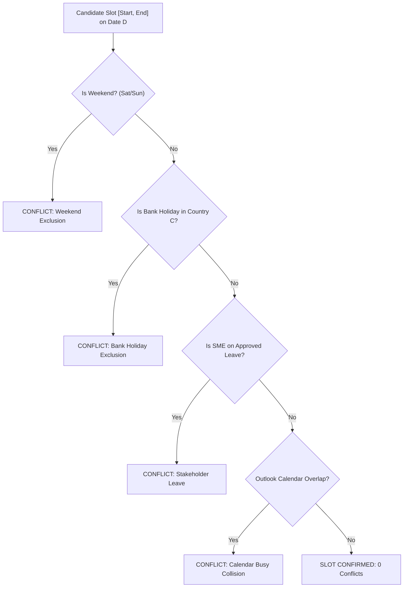

# KT Planner — Deterministic Core Engines & Mathematical Blueprint

## Introduction

In enterprise knowledge transfer orchestration, calculations affecting contract dates, capacity commitments, bank holidays, and calendar collisions must be **strictly deterministic**.

Unlike language models, which can hallucinate dates and round numbers unpredictably, KT Planner executes all numerical and scheduling logic through eight dedicated Python service engines in `backend/services/`.

---

## 1. `HolidayService` ([backend/services/holiday_service.py](file:///c:/Users/V6P5LAR/Downloads/KT_Planner_V4/backend/services/holiday_service.py))

### Architectural Mandate
- **Single Source of Truth**: All bank holidays must load exclusively from `holidays.json` at the root directory.
- **Zero Hardcoding**: No holiday dates or names may be hardcoded into Python source code.
- **Singleton In-Memory Cache**: Loads and caches JSON on startup to deliver sub-millisecond lookups.

### Supported Countries
Loads 30+ regional bank holiday calendars, including:
- `India` (Republic Day, Holi, Gandhi Jayanti, Dussehra, Diwali, etc.)
- `CzechRepublic` (Statehood Day, Good Friday, Easter Monday, etc.)
- `Germany`, `France`, `UnitedKingdom`, `Poland`, `Netherlands`, `Belgium`, `Albania`, and more.

### Working Day Equation
A calendar day $D$ is classified as a working day if and only if:
$$\text{IsWorkingDay}(C, D) = \neg \text{IsWeekend}(D) \land \neg \text{IsBankHoliday}(C, D)$$
Where:
- $\text{IsWeekend}(D) = \text{weekday}(D) \in \{5, 6\}$ (Saturday, Sunday)
- $\text{IsBankHoliday}(C, D) = \text{DateString}(D) \in \text{HolidaysCache}[C]$

---

## 2. `CapacityService` ([backend/services/capacity_service.py](file:///c:/Users/V6P5LAR/Downloads/KT_Planner_V4/backend/services/capacity_service.py))

### Mathematical Formulations

1. **Available KT Days**:
   $$\text{Available KT Days} = \max\Big(0, \text{Total Duration Days} - \text{Shadow Days} - \text{Reverse Shadow Days}\Big)$$

   *Example from Blueprint:*
   $$\text{Total Duration} = 60 \text{ Days}, \quad \text{Shadow} = 10 \text{ Days}, \quad \text{Rev. Shadow} = 10 \text{ Days}$$
   $$\text{Available KT Days} = 60 - 10 - 10 = 40 \text{ Days}$$

2. **Target KT Capacity (Hours)**:
   $$\text{Target Capacity Hours} = \text{Available KT Days} \times \text{Daily KT Hours}$$
   $$\text{Target Capacity} = 40 \times 5.0 = 200.0 \text{ Hours}$$

3. **Generated Capacity & Balance Ratio**:
   $$\text{Generated Hours} = \sum_{n \in \text{LeafNodes}} \text{EstimatedHours}(n)$$
   $$\text{Balance Ratio (\%)} = \left( \frac{\text{Generated Hours}}{\text{Target Capacity Hours}} \right) \times 100$$

### Capacity Status Decision Tree
- $\text{Generated Hours} < \text{Target Capacity}$: Status is `UNDER_ALLOCATED`. Agent 4 (Topic Decomposition) is triggered.
- $\text{Generated Hours} == \text{Target Capacity}$: Status is `BALANCED`. Fully optimized.
- $\text{Generated Hours} > \text{Target Capacity}$: Status is `OVER_ALLOCATED`. Warning flagged for review.

---

## 3. `CalendarImportService` ([backend/services/calendar_service.py](file:///c:/Users/V6P5LAR/Downloads/KT_Planner_V4/backend/services/calendar_service.py))

### Header Mapping Specification
Parses Microsoft Outlook exported calendar CSV files matching standard headers:
- `Subject`: Meeting or event title
- `Start Date`: Event start date (ISO, US, or EU format via `python-dateutil`)
- `Start Time`: Start time (HH:MM or 12h AM/PM)
- `End Date`: Event conclusion date
- `End Time`: Event conclusion time
- `All day event`: Boolean string (`True`/`False`)
- `Reminder on/off`: Boolean string (`True`/`False`)

### Privacy Masking
Enterprise participants can enable privacy masking during upload (`mask_subjects=true`). When enabled, confidential meeting subjects are automatically sanitized to `"Busy Event"`.

---

## 4. `AvailabilityService` ([backend/services/availability_service.py](file:///c:/Users/V6P5LAR/Downloads/KT_Planner_V4/backend/services/availability_service.py))

### 4-Tier Slot Conflict Detection
Before a session slot $[S_{\text{start}}, S_{\text{end}}]$ on date $D$ is scheduled with SME $P$, four collision tiers are evaluated:

### Time Overlap Condition
A calendar event $E$ collides with slot $S$ if:
$$\text{Start}(E) < \text{End}(S) \quad \land \quad \text{End}(E) > \text{Start}(S)$$

---

## 5. `SchedulingService` ([backend/services/scheduling_service.py](file:///c:/Users/V6P5LAR/Downloads/KT_Planner_V4/backend/services/scheduling_service.py))

### Pedagogical Level Sequencing Algorithm
To maximize learning retention and transition effectiveness, sessions are sequenced in strict pedagogical order:
1. **L1 (Foundational Overview)**: Architecture, high-level business flows, SLAs, repository layout.
2. **L2 (Technical Deep-Dive & Hands-On)**: Configuration, APIs, code navigation, CI/CD pipeline troubleshooting.
3. **L3 (Operational Handover & Reverse Shadowing)**: Incident simulations, disaster recovery live drills, independent ticket triage.

### Daily Packing & Workday Progression
- Working days are filtered through `HolidayService.is_working_day()`.
- Sessions are packed up to `daily_max_hours` (default: 5.0h).
- Dedicated lunch break buffer is maintained between 13:00 and 14:00 IST.
- Sessions that collide with stakeholder calendar events are tagged with specific conflict flags.

---

## 6. `ValidationService` ([backend/services/validation_service.py](file:///c:/Users/V6P5LAR/Downloads/KT_Planner_V4/backend/services/validation_service.py))

### 5-Category Governance Scorecard
Computes an automated transition audit evaluating:
1. **Hierarchy Completeness**: Validates 6 architectural tiers and leaf node density.
2. **KT Level Coverage**: Enforces that 100% of topics have documented learning objectives and measurable exit outcomes.
3. **Capacity Utilization Target**: Confirms generated hours match $\ge 100\%$ of target capacity.
4. **Calendar & Holiday Integrity**: Verifies zero sessions booked on bank holidays or weekends.
5. **Evidence Traceability**: Checks that topics are directly cited back to source intake documents.

---

## 7. `PatchService` ([backend/services/patch_service.py](file:///c:/Users/V6P5LAR/Downloads/KT_Planner_V4/backend/services/patch_service.py))

### Atomic Version Control
- Avoids full plan regenerations by applying surgical JSON diff patches.
- Increments version index monotonically ($v_{1} \rightarrow v_{2} \rightarrow v_{3}$).
- Preserves full audit logs of user modifications and Agent 5 refinements.

---

## 8. `ExportService` ([backend/services/export_service.py](file:///c:/Users/V6P5LAR/Downloads/KT_Planner_V4/backend/services/export_service.py))

### OpenPyXL Multi-Tab Workbook Generation
Generates the formal transition deliverable package with enterprise styling:
- Dark blue executive header styling (`#1E3A8A`) with white bold text.
- Thin borders (`#E5E7EB`) and enabled gridlines across all sheets.
- Dynamic auto-fitting of column widths.
- Streams in-memory without temporary file disk bloat.

