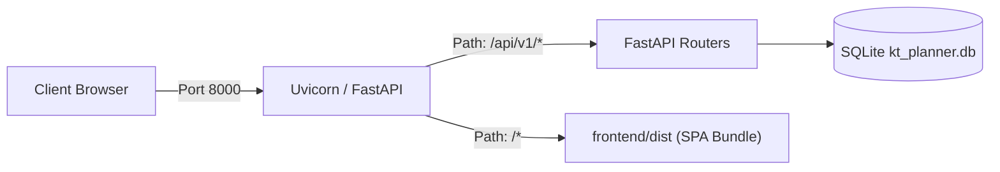

# KT Planner — Operations, Deployment & Support Runbook

## 1. Environment Requirements & Prerequisites

- **Operating System**: Windows Server 2019/2022, Windows 10/11, or Linux (RHEL 8+, Ubuntu 22.04+)
- **Python**: Version 3.13 (or 3.11+)
- **Node.js**: Version 20+ (with npm 10+)
- **Network**: Port `8000` (default for single deployable HTTP service)

---

## 2. Deployment Architecture

KT Planner runs as a **Single Deployable Service**:
FastAPI serves both API routes under `/api/v1` and static frontend assets (`frontend/dist/index.html` and `frontend/dist/assets/*`).



---

## 3. Installation & Build Runbook

### Step 1: Clone Repository & Install Python Dependencies
```powershell
pip install -r requirements.txt
# Or install core packages directly:
pip install fastapi uvicorn sqlalchemy pydantic python-multipart openpyxl pytest httpx python-dateutil langgraph langchain-core alembic
```

### Step 2: Build Frontend SPA Static Bundle
```powershell
cd frontend
npm install
npm run build
cd ..
```
The compiled assets will reside in `frontend/dist/`.

### Step 3: Run Alembic Database Migrations
```powershell
alembic upgrade head
```

---

## 4. Launching the Platform

### Windows (One-Click Batch Launcher)
Double-click `run_kt_planner.bat` or execute:
```powershell
.\run_kt_planner.bat
```

### Direct Production ASGI Invocation
```powershell
python -m uvicorn backend.main:app --host 0.0.0.0 --port 8000 --workers 2
```

Access the application in your browser at `http://localhost:8000`.

---

## 5. Automated Verification & Test Runbook

Run the complete test suite to verify holiday loading, capacity formulas, calendar conflict detection, and LangGraph workflow:

```powershell
python -m pytest tests/ -v
```

**Expected Result**:
```
collected 13 items
tests/test_api_workflow.py::test_full_kt_planner_api_workflow PASSED
tests/test_calendar.py::test_outlook_csv_parser PASSED
tests/test_capacity.py::test_capacity_target_calculations PASSED
tests/test_capacity.py::test_capacity_target_edge_cases PASSED
tests/test_database_gateway.py::test_controlled_sql_select_allowed PASSED
tests/test_database_gateway.py::test_controlled_sql_mutations_blocked PASSED
tests/test_holidays.py::test_holiday_service_loads_from_json PASSED
tests/test_holidays.py::test_india_holidays PASSED
tests/test_holidays.py::test_czech_holidays PASSED
tests/test_holidays.py::test_weekend_and_working_day PASSED
tests/test_langgraph_workflow.py::test_langgraph_workflow_execution PASSED
tests/test_single_deployable.py::test_single_deployable_serves_frontend PASSED
tests/test_single_deployable.py::test_single_deployable_serves_health_and_apis PASSED

====================== 13 passed ======================
```

---

## 6. Database Maintenance, Backup & Recovery

### Authoritative SQLite File
- Database file path: `kt_planner.db` at project root.
- Foreign key constraints are enforced via PRAGMA:
  ```python
  PRAGMA foreign_keys = ON;
  ```

### Backup Procedure
Because SQLite supports atomic snapshots, execute a hot backup without stopping the service:
```powershell
sqlite3 kt_planner.db ".backup 'backups/kt_planner_backup_%DATE%.db'"
```

### Recovery Procedure
To restore from backup:
1. Stop Uvicorn service.
2. Replace `kt_planner.db` with the verified backup file.
3. Restart Uvicorn service.

---

## 7. Health Checks & Monitoring

- **Health Endpoint**: `GET /health`
  - Response:
    ```json
    {
      "status": "healthy",
      "service": "KT Planner Master Backend",
      "version": "1.0.0",
      "authoritative_db": "SQLite kt_planner.db"
    }
    ```

---

## 8. Operational Troubleshooting & FAQ

### Issue 1: "holidays.json not found"
- **Cause**: The application was launched from a different working directory.
- **Remedy**: `backend/config.py` anchors all paths relative to `BASE_DIR`. Ensure `holidays.json` exists in the project root directory.

### Issue 2: Frontend displays blank screen
- **Cause**: Frontend static bundle not built.
- **Remedy**: Run `cd frontend; npm run build; cd ..` to regenerate `frontend/dist/`.

### Issue 3: SQL query rejected with HTTP 403
- **Cause**: User attempted to execute a query containing DML/DDL mutation keywords (`INSERT`, `UPDATE`, `DELETE`, `DROP`).
- **Remedy**: Use the typed mutation endpoints under `/api/v1/` for creating and updating records. The `/api/v1/database/query` endpoint is strictly read-only.

